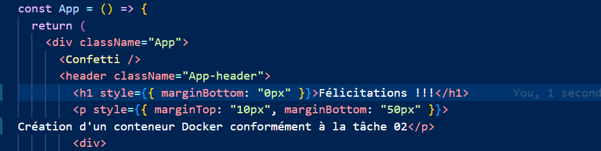

## Job 02
## L'objectif :
 Découvrir Docker de manière pratique en construisant, exécutant et modifiant une image Docker à partir d'un projet existant.(welcome-to-docker)
 ------------------------------------------
## 📂 Structure du projet
welcome-to-docker/
│
├── Dockerfile
├── package.json
├── package-lock.json
├── src/
├── public/
├── images/
│   ├── 01-clone-project.png
│   ├── 02-docker-build.png
│   ├── 03-docker-run.png
│   ├── 04-container-running.png
│   ├── 05-code-modification.png
│   └── 06-dockerhub-push.png
└── README.md
----------------------------------------------------------------
# Cloner le projet et ouvrir avec vscode;

-----------------------------------------------------------------------
# Analyse de Dockerfile
Node.js version 22 a été utilisé
avec la distribution Alpine Linux (légère et rapide) comme image de base.

WORKDIR /app
Toutes les commandes suivantes seront exécutées dans le dossier /app.
Le dossier /app est défini comme le répertoire principal de l'application.

COPY package.json ./
Les fichiers du package sont copiés avant le code principal afin de gérer les dépendances.

COPY ./src ./src

COPY ./public ./public
Le code source et les fichiers publics sont déplacés dans le conteneur.

npm install          ➜ Installer les dépendances
npm install -g serve ➜ Installer serve pour exécuter le build
npm run build        ➜ Compiler la version finale (production)
rm -fr node_modules  ➜ Supprimer les dépendances pour réduire la taille de l'image

EXPOSE 3000  ➜  Déclarez que l'application s'exécute sur le port 3000.
CMD [ "serve", "-s", "build" ]   ➜   docker run ...
---------------------------------------------------------------------
# Construction d'une image Docker
  docker build -t welcome-docker-job02 .
  

  Vérifier l'image créée = docker images
  
---------------------------------------------------------------------
# Exécution d'un conteneur
  docker run -d -p 3000:3000 --name welcome-container welcome-docker-job02
  

  vérifier de conteneurs = docker ps
  

  Afficher le résultat dans le navigateur :
 
---------------------------------------------------------------------
# Modification du code
  
---------------------------------------------------------------------
# Reconstruction et publication de l'image
Comme Docker ne détecte pas automatiquement les modifications, il faut :
  docker stop welcome-container
  
   
   docker rm welcome-container
    

    docker build -t welcome-docker-job02 .
    

    docker run -d -p 3000:3000 --name welcome-container welcome-docker-job02
    

    Afficher les modifications dans le navigateur
    
-----------------------------------------------------------------------
## Publier sur Docker Hub
   docker login
   

  docker tag welcome-docker-job02 username/welcome-docker-job02
  
  

  docker push username/welcome-docker-job02
  
   
   Recevoir des images d'autres personnes
   docker pull personne/welcome-docker-job02
-----------------------------------------------------------------------
### Problème rencontré

Lors du lancement du conteneur, une erreur est apparue indiquant que le nom du conteneur était déjà utilisé.

### Solution appliquée
Le conteneur existant a été arrêté puis supprimé avant de relancer un nouveau conteneur avec le même nom.
docker stop welcome-container
docker rm welcome-container
docker run -d -p 3000:3000 --name welcome-container welcome-docker-job02
------------------------------------------------------------------------------------

