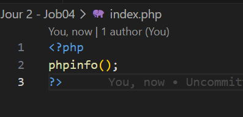
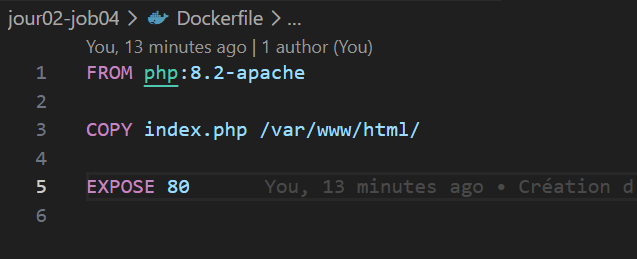
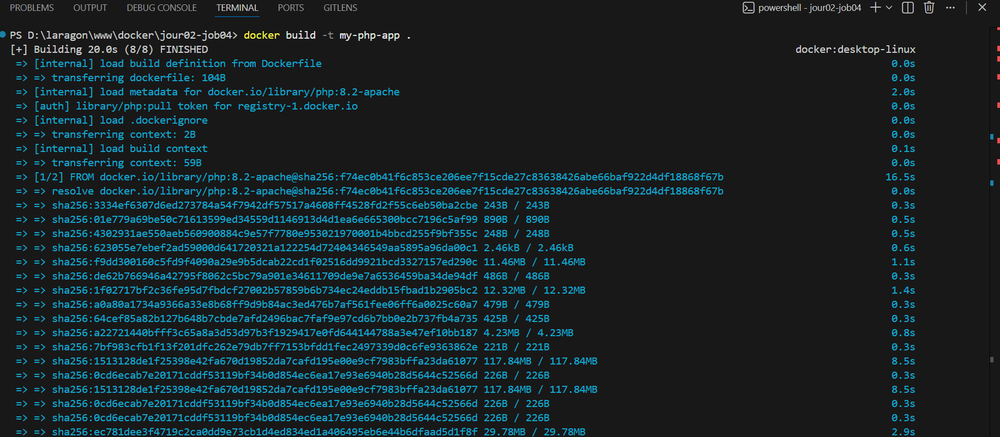
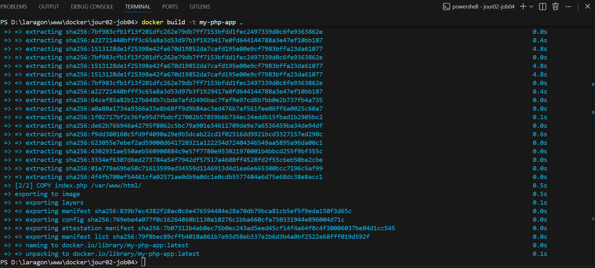
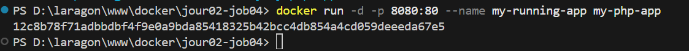
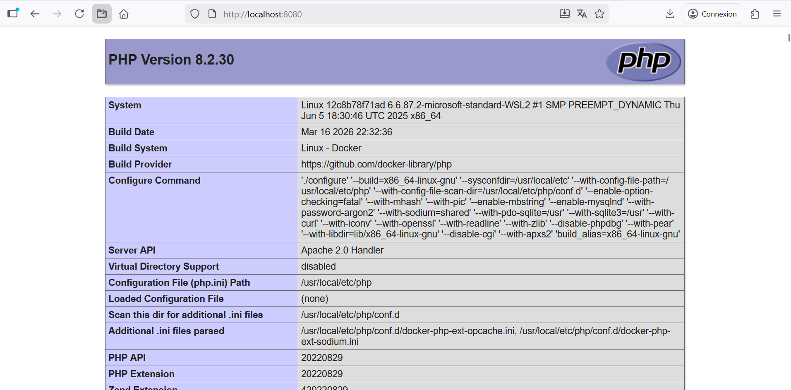
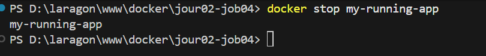

## 1. Création des fichiers sources
le fichier index.php avec la commande suivante pour afficher les informations du serveur:

------------------------------------------
## 2. Configuration du Dockerfile
Un fichier Dockerfile a été rédigé pour générer un environnement Apache/PHP avec les spécifications suivantes:
Utilisation de l'image officielle php:8.2-apache.

Copie du fichier index.php vers le répertoire /var/www/html/.

Exposition du port 80.

-------------------------------------------
## 3. Création de l'image (Build)

-------------------------------------------
## 4. Lancement du conteneur (Run)

Le conteneur a été lancé et exposé sur le port 8080 de la machine locale:

docker run -d -p 8080:80 --name my-running-app my-php-app

 

----------------------------------------------
## 5. Arrêt du conteneur (Stop)

 docker stop my-running-app

 

