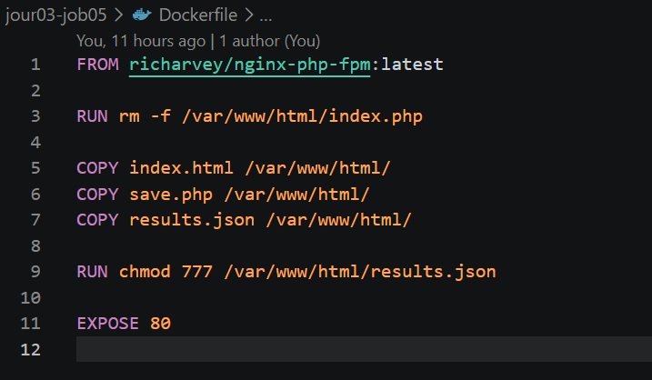
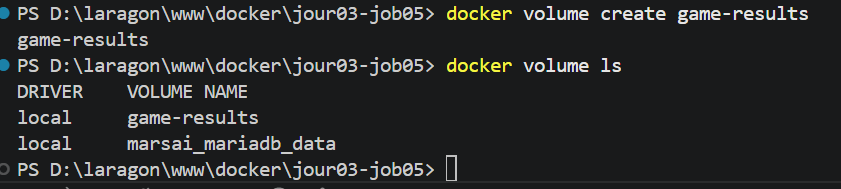
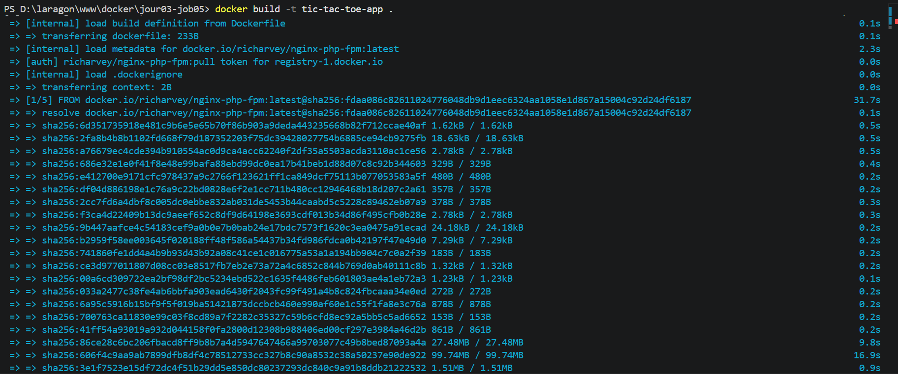

## Job 05 : Tic Tac Toe avec Docker et Volume

## Description du Projet

L'objectif de ce projet est de créer une image Docker et un volume pour héberger un jeu de morpion (Tic Tac Toe) et rendre la sauvegarde de ses résultats persistante.Les résultats sont stockés dans un volume dédié afin de ne pas être perdus à l'arrêt du conteneur.

## Fichiers du Projet
`index.html` : L'interface et la logique du jeu.

`save.php` : Le script serveur pour enregistrer les données.

`results.json` : Le fichier de base de données (initialisé vide `[]`).

`Dockerfile` : Le fichier de configuration pour construire l'image.

## Étapes de Réalisation et Commandes

### 1. Configuration du Dockerfile
Pour respecter l'utilisation d'un serveur web tout en supportant l'exécution du fichier PHP, une image combinant Nginx et PHP a été utilisée. 
Le port 80 a été exposé



### 2. Création du Volume
Un volume nommé "game-results" a été créé pour assurer la persistance des données.
Commande utilisée :
```bash
docker volume create game-results
docker volume ls 

````



### 3. Construction de l'image (Build)

L'image Docker a été construite avec la commande suivante:

```bash
docker build -t tic-tac-toe-app .
````
