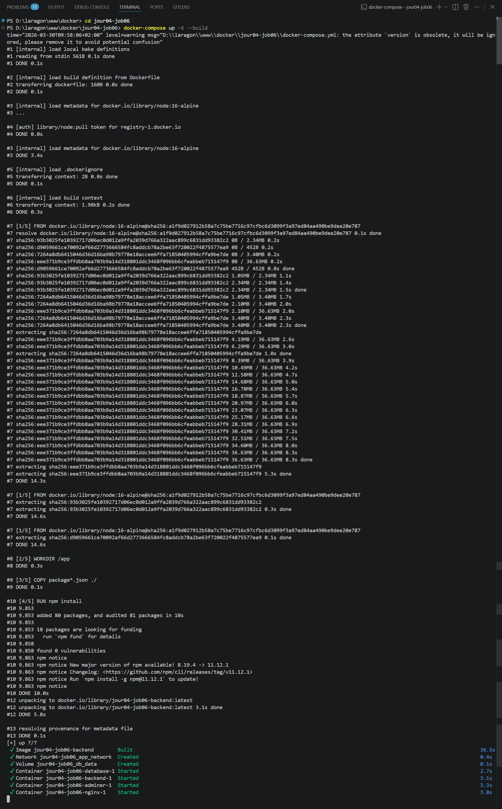
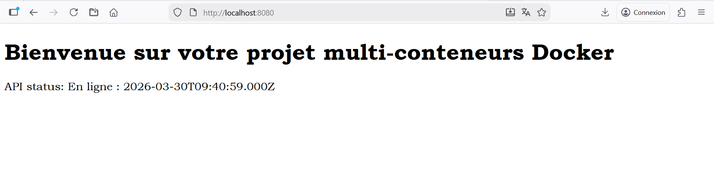
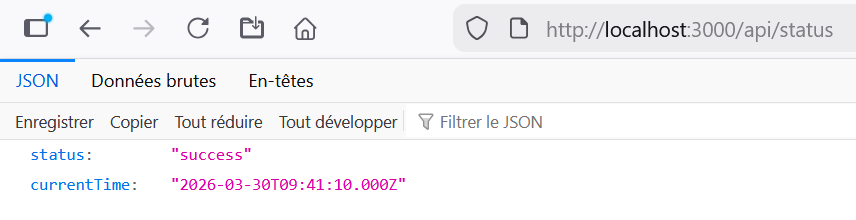
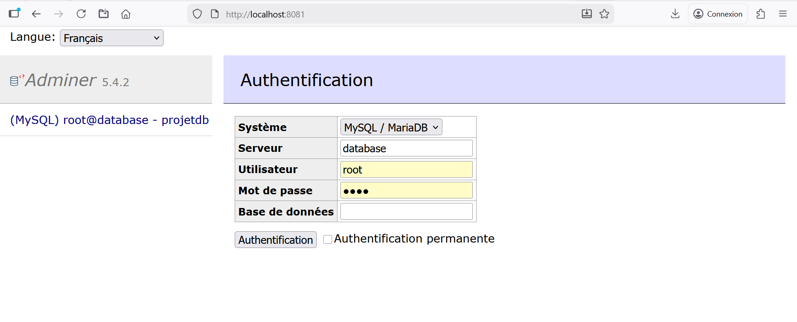
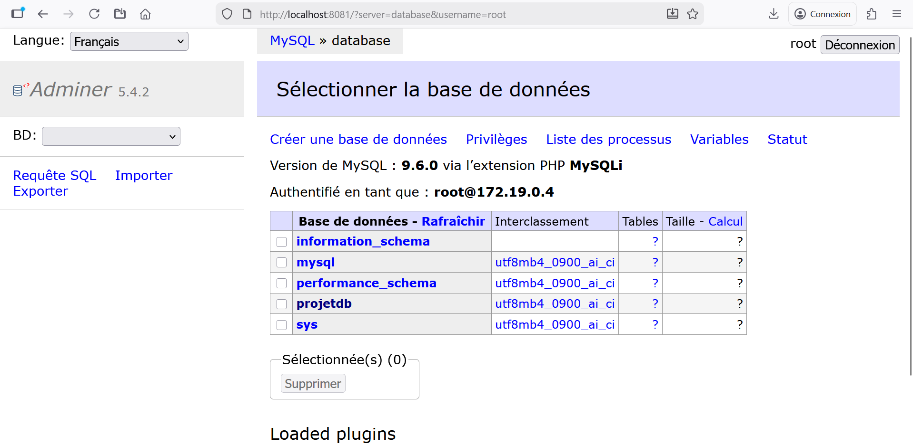

# Job 06 : Application Multi-conteneurs avec Docker Compose
## Description du Projet
L'objectif de ce projet est de déployer une application web complète composée de quatre services distincts (Base de données, Backend, Frontend, et Interface d'administration) en utilisant Docker Compose. Les conteneurs communiquent entre eux via un réseau Docker dédié, et les données de la base de données sont persistées à l'aide d'un volume.
## Architecture des Services
* **database** : Conteneur MySQL utiliser le port 3306
* **backend** : Backend Node.js pour interagir avec la base de
données utiliser le port 3000.
* **nginx** :  Frontend avec l’image alpine (image linux légère)
utiliser le port 8080.
* **adminer** :  Interface graphique pour accéder à la base de
données utiliser le port 8081.
## Étapes de Réalisation
### 1. Configuration de Docker Compose
Création du fichier `docker-compose.yml` définissant les quatre services, le réseau interne (`app_network`), et le volume pour la persistance des données (`db_data`).
### 2. Développement et Déploiement
* Création du `Dockerfile` et du serveur Node.js (`server.js`) pour le backend.
* Configuration du reverse proxy Nginx (`nginx.conf`) pour rediriger les requêtes API vers le backend.
* Lancement de l'infrastructure complète avec la commande :
  ```bash
  docker-compose up -d --build
  ```
  

### 3. Tests de Connectivité et Résultats

* A. Accès au Frontend (Nginx)
Vérification de l'interface utilisateur et de la connexion API sur **http://localhost:8080.**
 
### B. Accès au Backend (Node.js)
* Vérification de la route de statut de l'API sur **http://localhost:3000/api/status.**



### C. Administration de la Base de Données (Adminer)
* Connexion réussie à la base de données via l'interface Adminer sur **http://localhost:8081.**
 
